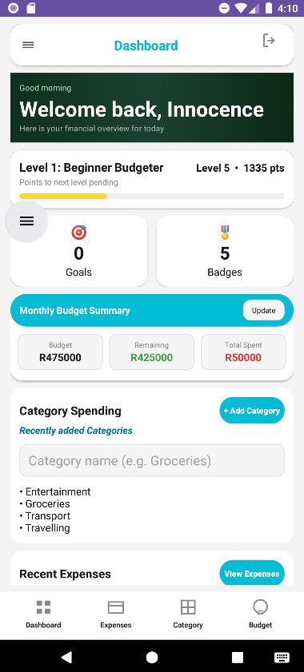
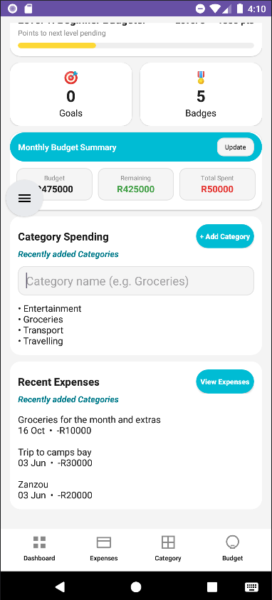
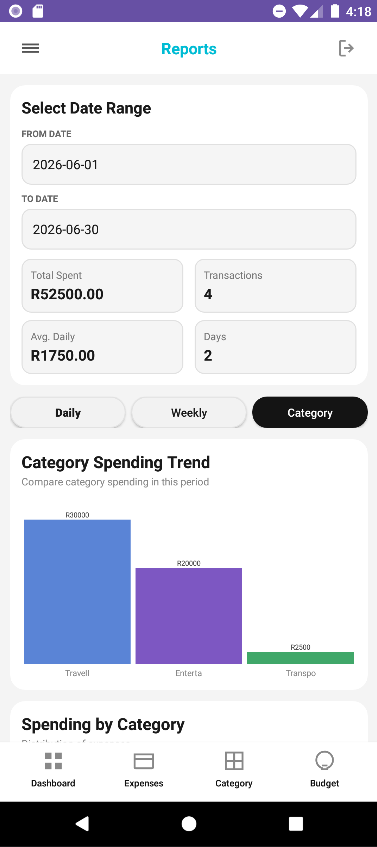
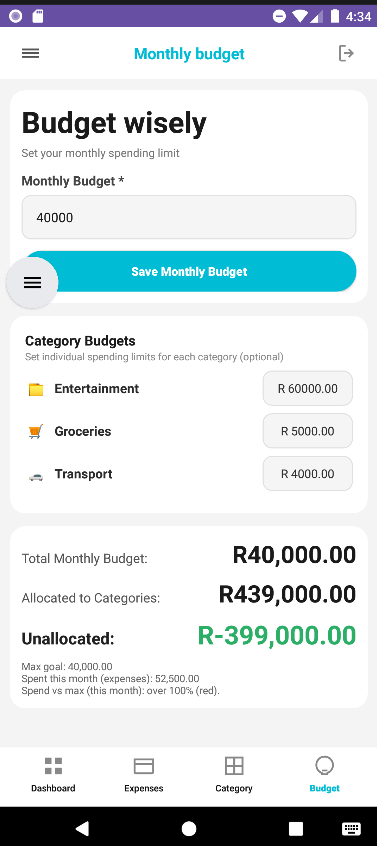
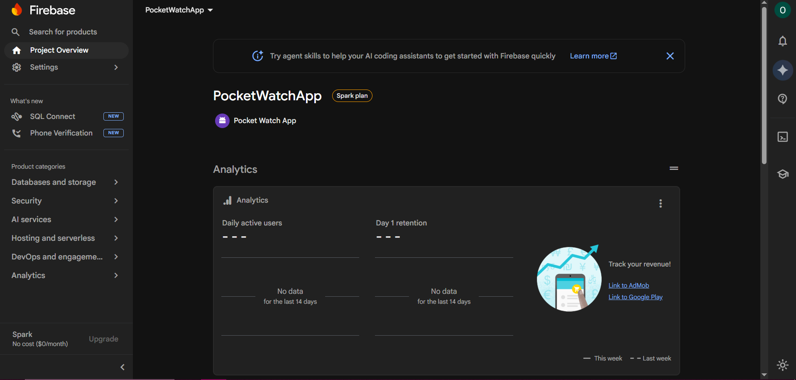

# Pocket Watch App

Pocket Watch is a mobile budgeting and personal finance tracker for **PROG7313 Part 3**. It helps users track spending, plan budgets, set savings goals, and stay motivated through light gamification. The app is built in **Kotlin** with XML layouts, stores expense data in **Firebase Realtime Database**, and includes reporting graphs and monthly spending goals required for the final PoE.

**Repository:** [github.com/EMGPRS/part3-final-poe-Maluleke-Khensani](https://github.com/EMGPRS/part3-final-poe-Maluleke-Khensani)  
**Android project folder:** `ProjectWatchApp_`

---

## Group Members

| Name | Student Number | Group |
|---|---|---|
| Joy Chivava | ST10453506 | 3 |
| Khensani Maluleke | ST10451309 | 2 |
| Khumo-Thato Chabeli | ST10448834 | 3 |
| Orearabetse Riba | ST10446648 | 2 |

For Part 3, work was split as follows: **Khumo-Thato** handled Firebase and online data, and wrote the **Data** and **Security** parts under Design Considerations; **Khensani** focused on business logic, bug fixes, GitHub Actions, and tests; **Joy** continued ViewModel and flow logic from Part 2, including evaluations; **Riba** prepared this README and submission documentation, and also took on the APK process preparing `release/PocketWatch-Part3.apk` for submission.

---

## Purpose of the App

Pocket Watch is aimed at students and young adults who want a straightforward way to manage money without full banking apps. Users can register and sign in, log expenses by category and date, plan a monthly budget, track savings goals, view spending reports, earn XP and badges, and read help content in the app.

Part 3 extended our Part 2 prototype by moving expense storage online, improving the UI based on lecturer feedback, and adding the spending graph, min/max monthly goals, and a clear visual indicator of whether the user is within their spending targets for the month. The final demo was recorded on a physical device.

---

## Features Overview

**Core flows**

- Authentication (registration, login, password hashing)
- Expenses (add, filter, totals, receipts where supported)
- Categories and budgets (monthly planning, per-category amounts)
- Savings goals (create, update progress, pin, history)
- Rewards (XP, levels, badges, level journey)
- Reports (daily / weekly / category views)
- Info & Help (FAQ)

**Part 3 additions**

- **Category spending graph** — On the Reports screen, the user selects a date range (*From* / *To*). The Category tab shows spending per category (bar chart, donut chart, and breakdown list).
- **Min and max monthly goals** — Set on the Budget screen. The summary shows the max goal, actual spend for the current month, and how category budgets fit under the cap.
- **Spending status** — `BudgetViewModel` compares current-month spend to the max goal and shows a plain-language status (on track, close to limit, or over). This uses green / yellow / red bands in the budget summary.
- **Online storage** — Expenses sync to Firebase Realtime Database (see below).

---

## Custom Features (Part 1 Design)

These are the two features we described in our Part 1 design document and implemented in the app.

### 1. Rewards and gamification

Users earn XP for using the app (for example logging expenses). Levels, badges, and a level journey screen make budgeting feel less like a chore. Logic lives in `RewardsViewModel` and `SessionManager`; the main screen is `RewardsActivity`.

### 2. Savings goals with progress history

Users can create goals with target amounts, update progress, pin important goals, and open a progress history sheet to see how contributions changed over time — not just a single “remaining amount” on a dashboard.

---

## Design Considerations

We kept the same overall shape as Part 2: **Activities** for screens, **ViewModels** for logic and validation, and **RoomDB** for local data. Part 3 added a small Firebase layer so expenses can live online while the UI still reads from RoomDB most of the time.

**UI** — Khensani led the visual side. Layouts live under `app/src/main/res/`. The `ui-reference` folder is only a design reference and is not what Gradle compiles. We fixed report calculations from Part 2 before polishing charts, and kept navigation (drawer and bottom nav) consistent across screens.

**Data** — *(Khumo-Thato Chabeli)* RoomDB holds users, expenses, budgets, categories, goals, and badges. When someone adds or deletes an expense, we write to Firebase as well. After login (or when opening expenses), the app can pull from the cloud and merge anything that exists online but not yet locally. Database migrations were important in Part 2; we added an instrumentation test so upgrading the schema does not wipe expense rows.

**Security** — *(Khumo-Thato Chabeli)* Passwords are hashed for local login. Firebase rules in `ProjectWatchApp_/firebase/database.rules.json` scope data under `project_watch_app` (tightened for production in a real deployment).

---

## Firebase Realtime Database

Firebase project: **pocketwatchapp-9a5ca**

| | |
|---|---|
| Console | https://console.firebase.google.com/project/pocketwatchapp-9a5ca |
| Database URL | https://pocketwatchapp-9a5ca-default-rtdb.europe-west1.firebasedatabase.app/ |
| Package name | `com.example.projectwatchapp` |

**Structure in the cloud**

```
project_watch_app/
  users/
    {userId}/
      expenses/
        {expenseId}/
```

**How we use it**

- **Write** — When a user saves an expense, `ExpenseViewModel` stores it in RoomDB and `FirebaseRealtimeDatabaseService.writeExpense()` pushes it to Firebase. Deletes call `deleteExpense()` on the cloud path.
- **Read** — `readExpensesForUser()` loads all expenses for a user; `listenToExpenses()` can subscribe to live updates. `ExpenseViewModel.syncExpensesFromCloud()` merges cloud data into RoomDB after login.
- **Config** — `google-services.json` in the `app` module and the database URL in `strings.xml` / `ProjectWatchApplication.kt`.

Main files: `FirebaseRealtimeDatabaseService.kt`, `FirebaseExpenseRecord.kt`, `ExpenseViewModel.kt`. We use `Log` with tag `FirebaseDatabase` when debugging sync issues.

---

## GitHub and Version Control

All Kotlin source is on GitHub (no zip submission). We work on **`main`** and commit as features are integrated. The Android code sits in **`ProjectWatchApp_`** — open that folder in Android Studio, not the repo root.

Early commits included RoomDB migrations, UI work, and report fixes. Part 3 added Firebase integration and several workflow fixes for CI (Gradle path, checksum, then a simpler `main.yml` without an extra Gradle setup step).

---

## GitHub Actions

We use a workflow called **Android Build** (`.github/workflows/main.yml`). On each push to `main`, GitHub checks out the repo, sets up **JDK 17**, and runs `./gradlew assembleDebug` inside `ProjectWatchApp_`.

Getting CI right took a few attempts. The first workflows failed because the working directory pointed at the wrong folder and an extra Gradle setup step caused problems. After Firebase was added we hit Gradle version/checksum errors. The pipeline we rely on now is **run #12** — build succeeds in about four to five minutes without the redundant setup step.

We referenced:

- [Automated Build Android App with GitHub Action](https://github.com/marketplace/actions/automated-build-android-app-with-github-action) (accessed 03 November 2025)
- [IMAD5112 build.yml example](https://github.com/IMAD5112/Github-actions/blob/main/.github/workflows/build.yml) (accessed 03 November 2025)

A successful build is visible on the repo **Actions** tab (workflow **Android Build**, run #12).

---

## Testing

**Automated**

- `BudgetViewModelTest` — monthly goal validation and GREEN / YELLOW / RED status for spend vs max goal
- `AppDatabaseMigrationTest` — migration from v1 to v2 keeps expense data when `photoPath` is added
- Standard `ExampleUnitTest` and `ExampleInstrumentedTest` scaffolding

CI currently builds the debug APK; we run unit tests locally with `./gradlew test` from `ProjectWatchApp_`. Instrumentation tests need a connected device or emulator.

**Manual**

We tested login, adding and deleting expenses (including visibility in Firebase), report date ranges and category charts, budget min/max goals and status text, navigation across screens, and migration behaviour after installs.

---

## Running the App and APK

**Setup**

1. Clone the repo and open **`ProjectWatchApp_`** in Android Studio.
2. Add **`google-services.json`** to `ProjectWatchApp_/app/` (from Firebase project settings).
3. Sync Gradle. The app targets **API 26** (Android 8.0) and above.

**Submission APK**

*(Built and packaged by Orearabetse Riba for submission.)*

The installable file for marking is:

**`ProjectWatchApp_/release/PocketWatch-Part3.apk`**

It is built from the debug APK (`assembleDebug`), which matches what GitHub Actions produces. Package: `com.example.projectwatchapp`, version 1.0 (versionCode 1). After rebuilding in Studio, copy the latest build over the release file:

```powershell
Copy-Item "app\build\outputs\apk\debug\app-debug.apk" "release\PocketWatch-Part3.apk" -Force
```

(run from inside `ProjectWatchApp_`)

To install on a phone without Studio, copy `PocketWatch-Part3.apk` to the device and allow installation from your file manager, or use `adb install` if USB debugging is enabled.

---

## Demonstration Video


### Video links

| Video | Link | Description |
|---|---|---|
|  Part 3| https://www.youtube.com/watch?v=POYVnnglUDY | Full feature walkthrough with voiceover and Firebase proof |
| Part 2 demos (reference) | [Demo 1](https://youtu.be/8eNBxrmB6-I) · [Demo 2](https://youtu.be/Yb3H48hMdGM) | Earlier prototypes |

---

## Challenges (Part 2 → Part 3)

- **Firebase** — Matching RoomDB expense IDs with Firebase keys and avoiding duplicate rows when syncing.
- **CI** — Gradle working directory, distribution checksum, and simplifying the workflow until builds were stable.
- **Reports** — Fixing wrong totals and breakdowns before investing time in custom charts.
- **UI vs logic** — Redesigning screens without breaking ViewModel bindings and IDs.
- **Environment** — JDK setup and Gradle memory issues on some machines interrupted local builds.
- **Team coordination** — Firebase, UI, logic, and docs happening in parallel required frequent merges and communication.

---

## What We Learned

- Plan Firebase paths early alongside RoomDB entities.
- Keep CI aligned with the Gradle wrapper in the repo; extra setup steps can do more harm than good.
- Fix report maths before drawing graphs.
- A shared README and regular merges reduce confusion when everyone touches different layers.

---

## References

1. Google — Firebase Realtime Database: https://firebase.google.com/docs/database  
2. GitHub Marketplace — Automated Build Android App with GitHub Action (03 November 2025)  
3. IMAD5112 — GitHub Actions `build.yml` example (03 November 2025)  
4. Android Developers — Room: https://developer.android.com/training/data-storage/room  
5. Riba, Orearabetse (ST10446648). *PROG7313 Planning and Design* — Pocket Watch App Part 1 planning and design document: [docs/references/PROG7313-Planning-and-Design-ST10446648.pdf](docs/references/PROG7313-Planning-and-Design-ST10446648.pdf)  

---

## Screenshots

App screens and Firebase proof (files in `docs/images/`, copied from `Downloads/Information/Screenshots`).

### Dashboard





### Reports (category graph and date range)



### Budget (min/max goals and monthly status)



### Firebase (online storage)




---

*Orearabetse Riba (ST10446648) — documentation. Last updated June 2026.*
